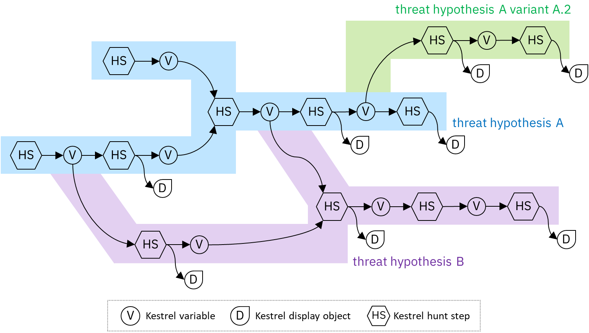
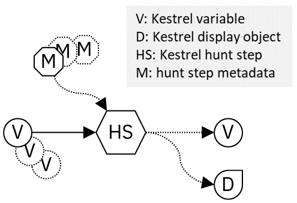
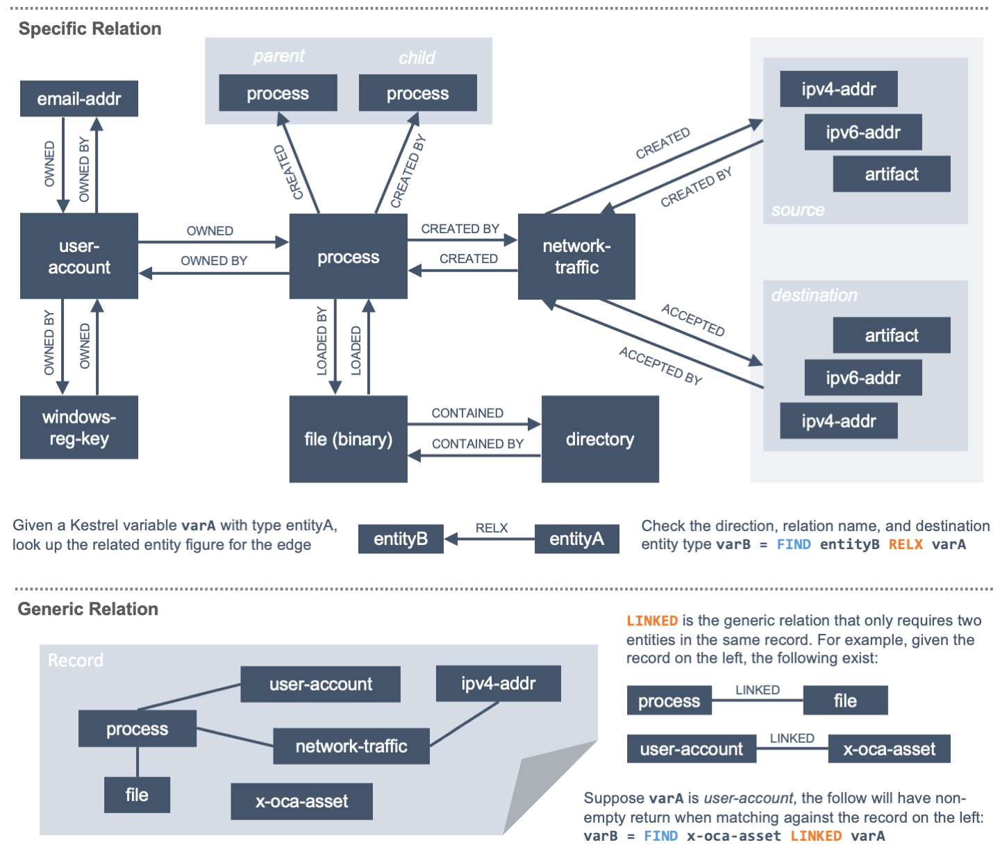
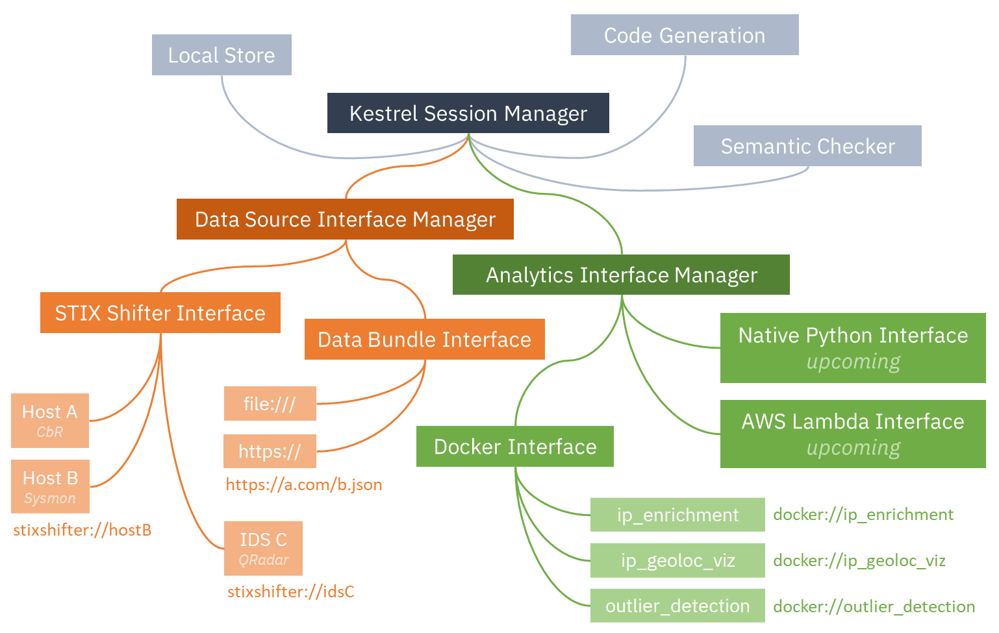

======================
Language Specification
======================

Introduce Kestrel language terms, concepts, syntax, and basic semantics for
writing individual hunting steps and composing large and reusable hunt flows.

Basic Terminology
=================

Record
------

A record, log, or observation yielded by a host or network monitoring system.
Usually a record contains information of an activity that is worth recording.
For example:

    - An ssh login attempt with root
    - A user login and logout
    - A process forking another process
    - A network connection initialized by a process
    - A process loading a dynamic loaded library
    - A process reading a sensitive file

Formally defined, a record is a piece of machine-generated data that is part of
a telemetry of the monitored host or network. Different monitoring systems
yield records in their own formats and define the scope of a record
differently. A monitoring system may yield a record for each file a process
loaded, while another monitoring system may yield a record with a two- or
three-level process tree plus loaded binaries and dynamic libraries as
additional file nodes in the tree.

Entity
------

An entity is a system or network object that can be identified by a monitor.
Different monitors may have different capabilities identifying entities: an IDS
can identify an IP or a host, while an EDR may identify a process or a file
inside the host.

A record yielded by a monitor contains one or more entities visible to the
monitor. For example:

    - A log of an ssh login attempt with root may contain three entities:
      the ssh process, the user root, and the incoming IP.
    - A web server, e.g., nginx, connection log entry may contain two
      entities: the incoming IP and the requested URL.
    - An EDR process tree record may contain several entities including the
      root process, its child processes, and maybe its grand child
      processes.
    - An IDS alert observation may contain two entities: the incoming IP
      and the target host.

Not only can a record contain multiple entities, but the same entity
identified by the same monitor may appear in different records. Some monitors
generate a universal identifier for an entity they track, i.e., UUID/GUID,
but this does not always hold. In addition, the description of an entity in a
record may be very incomplete due to the limited monitoring capability, data
aggregation, or software bug.

Hunt
----

A cyberthreat hunt is a procedure to find a set of entities in the monitored
environment that associates with a cyberthreat.

A comprehensive hunt or threat discovery finds a set of entities with their
relations, for example, control and data flows among them, as a graph that associates
with a cyberthreat. The comprehensive hunting definition assumes fully
connected telemetry data provided by monitoring systems and is discussed in the
:doc:`theory`.

Hunt Step
---------

A step in a hunt usually performs one of the four atom hunting operations:

    #. Retrieval: *getting a set of entities*. The entities may be directly
       retrieved back from a monitor or a data lake with stored monitored
       data, or can be quickly picked up at any cache layer on the path
       from the user to a data source.

    #. Transformation: *deriving different forms of entities*. Within a basic
       entity type such as *network-traffic*, threat hunters can perform simple
       transformation such as sampling or aggregating them based on their
       attributes. The results are special *network-traffic* with aggregated
       fields.

    #. Enrichment: *adding information to a set of entities*. Computing
       attributes or labels for a set of entities and attach them to the
       entities. The attributes can be context such as domain name for an
       IP address. They can also be threat intelligence information or even
       detection labels from existing intrusion detection systems.

    #. Inspection: *showing information about a set of entities*. For
       example, listing all attributes an labels of a set of entities;
       showing values of specified attributes of a set of entities.

    #. Flow-control: *merge or split hunt flows*. For example, merge the
       results of two hunt flows to apply the same hunt steps afterwords, or to
       fork a hunt flow branch for developing a variant of the threat
       hypothesis.

Hunt Flow
---------

The control flow of a hunt. A hunt flow comprises a series of hunt steps,
computing multiple sets of entities, and deriving new sets of entities based on
previous ones. Finally, a hunt flow reveals all sets of entities that are
associated with a threat.

A hunt flow in Kestrel is a sequence of Kestrel commands. It can be stored in a
plain text file with suffix ``.hf`` and executed by Kestrel command line, e.g.,
``kestrel apt51.hf``.

Hunt Book
---------

A hunt flow combined with its execution results in a notebook format.  Usually
a saved Jupyter notebook of a Kestrel hunt is referred to as a hunt book, which
contains the hunt flow in blocks and its execution results displayed in text,
tables, graphs, and other multi-media forms.

Key Concepts
============

Kestrel brings two key concepts to cyberthreat hunting.

Entity-Based Reasoning
----------------------

Humans understand threats and hunting upon entities, such as, malware, malicious
process, and C&C host. As a language for threat hunters to express *what to hunt*,
Kestrel helps hunters to organize their thoughts about threat hypotheses around
entities. Kestrel runtime assembles entities with pieces of information in
different records that describes different aspects of the entities. It also
proactively asks data sources to get information about entities. With this
design, threat hunters always have all of the information available about the entities
they are focusing on, and can confidently create and revise threat hypotheses
based on the entities and their connected entities. Meanwhile, threat
hunters do not need to spend time stitching and correlating records since most of
this tedious work on *how to hunt* is solved by Kestrel runtime.

Composable Hunt Flow
--------------------

Simplicity is the design goal of Kestrel, yet Kestrel does not sacrifice the
power of hunting. The secret sauce to achieve both is the idea of composability
from functional programming.

To compose hunt flows freely, Kestrel defines a common data model around
entities, that is, Kestrel variables, as the input and output of every hunt step.
Every hunt step yields a Kestrel variable (or None), which can be the input of
another hunt step. In addition to freely pipe hunt steps to compose hunt flows,
Kestrel also enables hunt flows forking and merging:

    - To fork a hunt flow, just consume the same Kestrel variable by another
      hunt step.
    - To merge hunt flows, just do a hunt step that takes in multiple Kestrel
      variables.

Here's an example of a composable Kestrel hunt flow:

Kestrel Variable
================

A Kestrel variable is a list of homogeneous entities---all entities in a
variable share the same type, for example, ``process``, ``network-traffic``, ``file``.
Each type of entities has its specialized attributes, for example, ``process`` has
``pid``, ``network-traffic`` has ``dst_port``, ``file`` has ``hashes``.

When using the STIX-Shifter_ data source interface, Kestrel loads `STIX Cyber
Observable Objects`_ (SCO) as basic telemetry data. The entity types and their
attributes are defined in `STIX specification`_. Note that STIX_ is open to
both custom attributes and custom entity types, and the entity type and
available attributes actually depends on the exact data source.

The naming rule of a Kestrel variable follows the variable naming rule in C
language: a variable starts with an alphabet or underscore ``_``, followed by
any combination of alphabet, digit, and underscore. There is no length limit
and a variable name is case sensitive.

Unlike immutable variables in pure functional programming languages, variables
in Kestrel are mutable. They can be partially updated, e.g., new attributes
added through an analytics, and they can be overwritten by a variable
assignment to an existing variable.

Kestrel Command
===============

A Kestrel command describes a `hunt step`_. All Kestrel commands can be put in
one of the four `hunt step`_ categories:

#. Retrieval: ``GET``, ``FIND``, ``NEW``.
#. Transformation: ``SORT``, ``GROUP``.
#. Enrichment: ``APPLY``.
#. Inspection: ``INFO``, ``DISP``.
#. Flow-control: ``SAVE``, ``LOAD``, ``COPY``, ``MERGE``, ``JOIN``.

To achieve `composable hunt flow`_ and allow threat hunters to compose hunt
flow freely, the input and output of any Kestrel command are defined as
follows:

A command takes in one or more variables and maybe some metadata, for example, the
path of a data source, the attributes to display, or the arguments to
analytics. In general, the command can either yield nothing, a variable, a
display object, or both a variable and a display object.

- As illustrated in the figure of `composable hunt flow`_, Kestrel variables
  consumed and yielded by commands play the key role to connect different hunt
  steps (commands) into hunt flows.

- A display object is something to be displayed by a Kestrel front end, for example,
  a Jupyter Notebook. It is not consumed by any of the following hunt steps. It only
  presents information from a hunt step to the user, such as a tabular display of
  entities in a variable, or an interactive visualization of entities.

+---------+----------------+---------------+----------------+---------------+
| Command | Take Variable  | Take Metadata | Yield Variable | Yield Display |
+=========+================+===============+================+===============+
| GET     | no             | yes           | yes            | no            |
+---------+----------------+---------------+----------------+---------------+
| FIND    | yes            | yes           | yes            | no            |
+---------+----------------+---------------+----------------+---------------+
| NEW     | no             | data          | yes            | no            |
+---------+----------------+---------------+----------------+---------------+
| APPLY   | yes (multiple) | yes           | no (update)    | maybe         |
+---------+----------------+---------------+----------------+---------------+
| INFO    | yes            | no            | no             | yes           |
+---------+----------------+---------------+----------------+---------------+
| DISP    | yes            | maybe         | no             | yes           |
+---------+----------------+---------------+----------------+---------------+
| SORT    | yes            | yes           | yes            | no            |
+---------+----------------+---------------+----------------+---------------+
| GROUP   | yes            | yes           | yes            | no            |
+---------+----------------+---------------+----------------+---------------+
| SAVE    | yes            | yes           | no             | no            |
+---------+----------------+---------------+----------------+---------------+
| LOAD    | no             | yes           | yes            | no            |
+---------+----------------+---------------+----------------+---------------+
| COPY    | yes            | no            | yes            | no            |
+---------+----------------+---------------+----------------+---------------+
| MERGE   | yes (two)      | no            | yes            | no            |
+---------+----------------+---------------+----------------+---------------+
| JOIN    | yes (two)      | yes           | yes            | no            |
+---------+----------------+---------------+----------------+---------------+

GET
---

The command ``GET`` is a *retrieval* hunt step to match a STIX pattern against
a pool of entities and return a list of homogeneous entities (a subset of
entities in the pool satisfying the pattern).

Syntax
^^^^^^
::

    returned_variable = GET returned_entity_type FROM entity_pool WHERE stix_pattern

- The returned entity type is specified right after the keyword ``GET``.

- The pool of entities should be specified in the ``FROM`` clause of ``GET``.

    - The pool can be a data source, for example, a data lake where monitored logs are
      stored, an EDR, a firewall, an IDS, a proxy server, or a SIEM system. In
      this case, the user needs to know the identifier of the data source (more
      in section `Data Source And Analytics Interfaces`_). For example:

        - ``stixshifter://server101``: EDR on server 101 accessible via STIX-Shifter.
        - ``https://a.com/b.json``: sealed telemetry data in a STIX bundle.

    - The pool can also be an existing Kestrel variable. In this case, just use
      the variable name.

- The `STIX pattern`_ (what is interesting) should be specified in the
  ``WHERE`` clause of ``GET``. The STIX pattern should be described around the
  returned entity---all comparison expressions in the STIX pattern should start
  with the entity type as same as the returned entity type of the ``GET``.

  For example, when getting back processes ``newvar = GET process ...``, all
  comparison expressions in the STIX pattern in the ``WHERE`` cause should
  start with ``process:``, e.g., ``process:attributeA = 'xxx'``,
  ``process:attributeB = 'yyy'``.

  The STIX pattern in Kestrel goes beyond standard STIX to allow variable
  reference in the pattern, e.g., ``[process:pid = kvar1.pid AND process:name =
  kvar2.name]``. Kestrel runtime compiles this parameterized STIX pattern into
  standard STIX before querying the entity pool.

  It is strongly encouraged to add time range qualifiers ``START t'timestamp'
  STOP t'timestamp'`` at the end of the STIX pattern when the entity pool is a
  data source and there is no referred Kestrel variable in the STIX pattern.

    - ``timestamp`` here should be in ISO timestamp format defined in `STIX
      timestamp`_.

    - Press ``tab`` to auto-complete a half-way input timestamp to the closet
      next timetamp, e.g., ``2021-05`` to ``2021-05-01T00:00:00Z``

    - The time range, when used, should always have both ``START`` and
      ``STOP``.

    - Time range inference: If one or more Kestrel variables are referred in
      the STIX pattern, Kestrel runtime infers the time range from all entities
      in the referred variables.

    - Time range override: If a user provides time range at the same time, it
      overrides the inferred time range if any.

    - Missing time range: If no time range provided or inferred in a ``GET``
      command, it depends on the data source interface to decide how to handle
      it. For example, the STIX-Shifter interface will use last five minutes as
      the time range if not specified.

- Syntax sugar: If the entity pool in ``GET`` is a data source and it is the
  same as the data source used in a previous ``GET`` command, the ``FROM``
  clause can be omitted. Kestrel runtime completes the ``FROM`` clause for a
  ``GET`` command (if it is omitted) using the last *data source* in the
  execution. The variable entity pool is not used. See an example (the last one)
  below.

Examples
^^^^^^^^
::

    # get processes from server101 which has a parent process with name 'abc.exe'
    procs = GET process FROM stixshifter://server101 WHERE [process:parent_ref.name = 'abc.exe']
            START t'2021-05-06T00:00:00Z' STOP t'2021-05-07T00:00:00Z'

    # get files from a sealed STIX bundle with hash 'dbfcdd3a1ef5186a3e098332b499070a'
    # Kestrel allows to write a command in multiple lines
    binx = GET file
           FROM https://a.com/b.json
           WHERE [file:hashes.'MD5'= 'dbfcdd3a1ef5186a3e098332b499070a']
           START t'2021-05-06T00:00:00Z' STOP t'2021-05-07T00:00:00Z'

    # get processes from the above procs variable with pid 10578 and name 'xyz'
    # no time range needed since the entity pool is a varible
    procs2 = GET process FROM procs WHERE [process:pid = 10578 AND process:name = 'xyz']

    # refer to another Kestrel variable in the STIX pattern (not standard STIX)
    # note that the attribute of a variable should be var.attribute, not var:attribute
    # no time range needed: (1) the entity pool is a varible (2) there is a referred variable
    procs3 = GET process FROM procs WHERE [process:pid = procs2.pid]

    # omitting the FROM clause, which will be desugarred as 'FROM https://a.com/b.json'
    procs4 = GET process WHERE [process:pid = 1234]
             START t'2021-05-06T00:00:00Z' STOP t'2021-05-07T00:00:00Z'

FIND
----

The command ``FIND`` is a *retrieval* hunt step to return entities connected to a
given list of entities.

Syntax
^^^^^^
::

    returned_variable = FIND returned_entity_type RELATIONFROM input_variable [START t'timestamp' STOP t'timestamp']

Kestrel defines the relation abstraction between entities as shown in the
entity-relation chart:

To find child processes of processes in a variable ``varA``, you can look up
the entity-relation chart and get relation ``CREATED BY``, then write the
command ``varB = FIND process CREATED BY varA``.

The optional time range works similar to that in the STIX pattern of ``GET``.
However, it is not often used in ``FIND`` since ``FIND`` always has an input
variable to infer time range. If you want Kestrel to search for a
specific time range instead of the inferred range, use ``START/STOP``.

Examples
^^^^^^^^
::

    # find parent processes of processes in procs
    parent_procs = FIND process CREATED procs

    # find child processes of processes in procs
    parent_procs = FIND process CREATED BY procs

    # find network-traffic associated with processes in procs
    nt = FIND network-traffic CREATED BY procs

    # find processes associated with network-traffic in nt
    ntprocs = FIND process CREATED network-traffic

    # find source IP addresses in nt
    src_ip = FIND ipv4-addr CREATED nt

    # find destination IP addresses in nt
    src_ip = FIND ipv4-addr ACCEPTED nt

    # find both source and destination IP addresses in nt
    src_ip = FIND ipv4-addr LINKED nt

    # find network-traffic which have source IP src_ip
    ntspecial = FIND network-traffic CREATED BY src_ip

Relation With GET
^^^^^^^^^^^^^^^^^

Both ``FIND`` and ``GET`` are *retrieval* hunt steps. ``GET`` is the most
fundamental retrieval hunt step. And ``FIND`` provides a layer of abstraction
to retrieve connected entities more easily than using the raw ``GET`` for this,
that is, ``FIND`` can be replaced by ``GET`` in theory with some knowledge of *how
to hunt*. Kestrel tries to focus threat hunters on *what to hunt* and automate
the generation of *how to hunt* (see :doc:`overview`). Finding connected
entities requires knowledge on how the underlying records are connected, and
Kestrel resolves the how for users with the command ``FIND``.

In theory, you can replace ``FIND`` with ``GET`` and a parameterized STIX
pattern when knowing how the underlying records are connected. In reality, this
is not possible with STIX pattern in ``GET``.

- The dereference of connection varies from one data source to another. The
  connection may be recorded as a reference attribute in a record like the
  ``*_ref`` attributes in STIX 2.0. It can also be recorded via a hidden object
  like the *SRO* object in STIX 2.1.

- STIX pattern does not allow reference to an object directly, for example,
  ``[process:parent_ref = xxx]`` is not a valid STIX pattern. Also one cannot
  use ``[process:parent_ref.id = xxx.id]`` since the ``id`` of entities are not
  persistent across different records/observations.

- STIX pattern does not support expressing one-to-many mapping, for example, there is
  a reference ``opened_connection_refs`` in a process record, but there is no
  way to express all ``network-traffic`` entities referred in that list.

NEW
---

The command ``NEW`` is a special *retrieval* hunt step to create entities
directly from given data.

Syntax
^^^^^^
::

    returned_variable = NEW [returned_entity_type] data

The given data can either be:

- A list of string ``[str]``. If this is used, ``returned_entity_type`` is
  required. Kestrel runtime creates the list of entities based on the return
  type. Each entity will have one initial attribute.

    - The name of the attribute is decided by the returned type.

      +----------------------+-------------------+
      | Return Entity Type   | Initial Attribute |
      +======================+===================+
      | process              | name              |
      +----------------------+-------------------+
      | file                 | name              |
      +----------------------+-------------------+
      | mutex                | name              |
      +----------------------+-------------------+
      | software             | name              |
      +----------------------+-------------------+
      | user-account         | user_id           |
      +----------------------+-------------------+
      | directory            | path              |
      +----------------------+-------------------+
      | autonomous-system    | number            |
      +----------------------+-------------------+
      | windows-registry-key | key               |
      +----------------------+-------------------+
      | x509-certificate     | serial_number     |
      +----------------------+-------------------+

    - The number of entities is the length of the given list of string.

    - The value of the initial attribute of each entity is the string in the given data.

- A list of dictionaries ``[{str: str}]``. All dictionaries should share the
  same set of keys, which are attributes of the entities. If ``type`` is
  not provided as a key, ``returned_entity_type`` is required.

The given data should follow JSON format, for example, using double quotes around a
string. This is different from a string in STIX pattern, which is surrounded by
single quotes.

Examples
^^^^^^^^
::

    # create a list of processes with their names
    newprocs = NEW process ["cmd.exe", "explorer.exe", "google-chrome.exe"]

    # create a list of processes with a list of dictionaries
    newvar = NEW [ {"type": "process", "name": "cmd.exe", "pid": "123"}
                 , {"type": "process", "name": "explorer.exe", "pid": "99"}
                 ]

    # return entity type is required if not a key in the data
    newvar2 = NEW process [ {"name": "abc.exe", "pid": "1234"}
                          , {"name": "ie.exe", "pid": "10"}
                          ]

APPLY
-----

The command ``APPLY`` is an *enrichment* hunt step to compute and add
attributes to Kestrel variables. Enrichment, in this context, includes the computation of
enriched data, such as malware detection analytics, and associating the data to
the entities, such as adding the detection labels to the entities.

Syntax
^^^^^^
::

    APPLY analytics_identifier ON var1, var2, ... WITH x=1, y=abc

- Input: The command takes in one or multiple variables.

- Execution: The command executes the analytics specified by
  ``analytics_identifier`` like ``docker://ip_domain_enrichment`` or
  ``docker://pin_ip_on_map``.

  There is no limitation for what an analytics could do besides the input and
  output specified by its corresponding Kestrel analytics interface (see `Data
  Source And Analytics Interfaces`_).

  An analytics could run entirely locally and then just do a table lookup. It could
  reach out to the internet like the VirusTotal servers. It could perform
  real-time behavior analysis of binary samples. Based on specific analytics
  interfaces, some analytics can run entirely in the cloud, and the interface
  harvests the results to local Kestrel runtime.

  Threat hunters can quickly wrap an existing security program/module into a
  Kestrel analytics. For example, creating a Kestrel analytics as a docker
  container and utilizing the existing Kestrel Docker Analytics Interface
  (check :doc:`source/kestrel_analytics_docker.interface`). You can also
  easily develop new analytics interfaces to provide special running
  environments (check :doc:`source/kestrel.analytics.interface`).

- Output: The executed analytics could yield either *(a)* data for variable
  updates, or *(b)* a display object, or both. The ``APPLY`` command passes
  the impacts to the Kestrel session:

    - Updated variable(s): The most common enrichment is adding/updating
      attributes to input variables (existing entities). The attributes can be,
      yet not limited to:

        - Detection results: The analytics performs threat detection on the
          given entities. The results can be any scalar values such as strings,
          integers, or floats. For example, malware labels and their families
          could be strings, suspicious scores could be integers, and likelihood
          could be floats. Numerical data can be used by later Kestrel commands
          such as ``SORT``. Any new attributes can be used in the ``WHERE``
          clause of the following ``GET`` commands to pick a subset of
          entities.

        - Threat Intelligence (TI) information: Commonly known as TI
          enrichment, for example, Indicator of Comprise (IoC) tags.

        - Generic information: The analytics can add generic information that
          is not TI-specific, such as adding software description as new
          attributes to ``software`` entities based on their ``name``
          attributes.

    - Kestrel display object: An analytics can also yield a display object for
      the front end to show. Visualization analytics yield such data such as
      our ``docker://pin_ip`` analytics that looks up the geolocation of IP
      addresses in ``network-traffic`` or ``ipv4-addr`` entities and pin them
      on a map, which can be shown in Jupyter Notebooks.

- There is no *new* return variable from the command.

Examples
^^^^^^^^
::

    # A visualization analytics:
    # Finding the geolocation of IPs in network traffic and pin them on a map
    nt = GET network-traffic FROM stixshifter://idsX WHERE [network-traffic:dst_port = 80]
    APPLY docker://pin_ip ON nt

    # A beaconing detection analytics:
    # a new attribute "x_beaconing_flag" is added to the input variable
    APPLY docker://beaconing_detection ON nt

    # A suspicious process scoring analytics:
    # a new attribute "x_suspiciousness" is added to the input variable
    procs = GET process FROM stixshifter://server101 WHERE [process:parent_ref.name = 'bash']
    APPLY docker://susp_proc_scoring on procs
    # sort the processes
    procs_desc = SORT procs BY x_suspiciousness DESC
    # get the most suspicous ones
    procs_sus = GET process FROM procs WHERE [process:x_suspiciousness > 0.9]

    # A domain name lookup analytics:
    # a new attribute "x_domain_name" is added to the input variable for its dest IPs
    APPLY docker://domain_name_enrichment ON nt

INFO
----

The command ``INFO`` is an *inspection* hunt step to show details of a Kestrel
variable.

Syntax
^^^^^^
::

    INFO varx

The command shows the following information of a variable:

- Entity type
- Number of entities
- Number of records
- Entity attributes
- Indirect attributes
- Customized attributes
- Birth command
- Associated datasource
- Dependent variables

The attribute names are especially useful for users to construct ``DISP``
command with ``ATTR`` clause.

Examples
^^^^^^^^
::

    # showing information like attributes and how many entities in a variable
    nt = GET network-traffic FROM stixshifter://idsX WHERE [network-traffic:dst_port = 80]
    INFO nt

DISP
----

The command ``DISP`` is an *inspection* hunt step to print attribute values of
entities in a Kestrel variable. The command returns a tabular display object to
a front end, for example, Jupyter Notebook.

Syntax
^^^^^^
::

    DISP varx [ATTR attribute1, attribute2, ...]

- The optional clause ``ATTR`` specifies which list of attributes you
  would like to print. If omitted, Kestrel will output all attributes.

- The command deduplicates rows. All rows in the display object are distinct.

- The command goes through all records/logs in the local storage about entities
  in the variable. Some records may miss attributes that other records have,
  and it is common to see empty fields in the table printed.

- If you are not familiar with the data, you can use ``INFO`` to list all attributes
  and pick up some attributes to write the ``DISP`` command and ``ATTR``
  clause.

Examples
^^^^^^^^
::

    # display <source IP, source port, destination IP, destination port>
    nt = GET network-traffic FROM stixshifter://idsX WHERE [network-traffic:dst_port = 80]
    DISP nt ATTR src_ref.value, src_port, dst_ref.value, dst_port

    # display process pid, name, and command line
    procs = GET process FROM stixshifter://edrA WHERE [process:parent_ref.name = 'bash']
    DISP procs ATTR pid, name, command_line

SORT
----

The command ``SORT`` is a *transformation* hunt step to reorder entities in a
Kestrel variable and output the same set of entities with the new order to a new
variable.

Syntax
^^^^^^
::

    newvar = SORT varx BY stixpath [ASC|DESC]

- The ``stixpath`` can be a full STIX path like ``process:attribute`` or just
  an attribute name like ``pid`` if ``varx`` is ``process``.

- By default, data will be sorted by descending order. The user can specify the
  direction explicitly such as ``ASC``: ascending order.

Examples
^^^^^^^^
::

    # get network traffic and sort them by their destination port
    nt = GET network-traffic FROM stixshifter://idsX WHERE [network-traffic:dst_ref_value = '1.2.3.4']
    ntx = SORT nt BY dst_port ASC

    # display all destination port and now it is easy to check important ports
    DISP ntx ATTR dst_port

GROUP
-----

The command ``GROUP`` is a *transformation* hunt step to group entities based
on one or more attributes as well as computing aggregated attributes for the
aggregated entities.

Syntax
^^^^^^
::

    aggr_var = GROUP varx BY attr1, attr2... [WITH aggr_fun(attr3) [AS alias], ...]

- If no aggregation functions are specified, they will be chosen
  automatically.  In that case, attributes of the returned entities
  are decorated with a prefix ``unique_`` such as ``unique_pid``
  instead of ``pid``.

- When aggregations are specified without ``alias``, aggregated
  attributes will be prefixed with the aggregation function such as
  ``min_first_observed``.

- Support aggregation functions:

  - ``MIN``: minimum value
  - ``MAX``: maximum value
  - ``AVG``: average value
  - ``SUM``: sum of values
  - ``COUNT``: count of non-null values
  - ``NUNIQUE``: count of unique values

Examples
^^^^^^^^
::

    # group processes by their name and display
    procs = GET process FROM stixshifter://edrA WHERE [process:parent_ref.name = 'bash']
    aggr = GROUP procs BY name
    DISP aggr ATTR unique_name, unique_pid, unique_command_line

SAVE
----

The command ``SAVE`` is a *flow-control* hunt step to dump a Kestrel variable
to a local file.

Syntax
^^^^^^
::

    SAVE varx TO file_path

- All records of the entities in the input variable will be packaged in the
  output file.

- The suffix of the file path decides the format of the file. Current supported formats:

    - ``.csv``: CSV file.
    - ``.parquet``: parquet file.
    - ``.parquet.gz``: gzipped parquet file.

- It is useful to save a Kestrel variable into a file for analytics development.
  The docker analytics interface actually does the same to prepare the input
  for a docker container.

Examples
^^^^^^^^
::

    # save all process records into /tmp/kestrel_procs.parquet.gz
    procs = GET process FROM stixshifter://edrA WHERE [process:parent_ref.name = 'bash']
    SAVE procs TO /tmp/kestrel_procs.parquet.gz

LOAD
----

The command ``LOAD`` is a *flow-control* hunt step to load data from disk into
a Kestrel variable.

Syntax
^^^^^^
::

    newvar = LOAD file_path [AS entity_type]

- The suffix of the file path decides the format of the file. Current supported formats:

    - ``.csv``: CSV file.
    - ``.parquet``: parquet file.
    - ``.parquet.gz``: gzipped parquet file.

- The command loads records for the same type of entities. If there is no
  ``type`` column in the data, the returned entity type should be specified in
  the ``AS`` clause.

- Using ``SAVE`` and ``LOAD``, you can transfer data between hunts.

- A user can ``LOAD`` external Threat Intelligence (TI) records into a Kestrel
  variable.

Examples
^^^^^^^^
::

    # save all process records into /tmp/kestrel_procs.parquet.gz
    procs = GET process FROM stixshifter://edrA WHERE [process:parent_ref.name = 'bash']
    SAVE procs TO /tmp/kestrel_procs.parquet.gz

    # in another hunt, load the processes
    pload = LOAD /tmp/kestrel_procs.parquet.gz

    # load suspicious IPs from a threat intelligence source
    # the file /tmp/suspicious_ips.csv only has one column `value`, which is the IP
    susp_ips = LOAD /tmp/suspicious_ips.csv AS ipv4-addr

    # check whether there is any network-traffic goes to susp_ips
    nt = GET network-traffic
         FROM stixshifter://idsX
         WHERE [network-traffic:dst_ref.value = susp_ips.value]

COPY
----

The command ``COPY`` is an *flow-control* hunt step to copy a variable to another.

Syntax
^^^^^^
::

    newvar = oldvar

MERGE
-----

The command ``MERGE`` is a *flow-control* hunt step to union entities in
multiple variables.

Syntax
^^^^^^
::

    merged_var = var1 + var2 + var3 + ...

- The command provides a way to merge hunt flows.

- All input variables to the command should share the same entity type.

Examples
^^^^^^^^
::

    # one TTP matching
    procsA = GET process FROM stixshifter://edrA WHERE [process:parent_ref.name = 'bash']

    # another TTP matching
    procsB = GET process FROM stixshifter://edrA WHERE [process:binary_ref.name = 'sudo']

    # merge results of both
    procs = procsA + procsB

    # further hunt flow
    APPLY docker://susp_proc_scoring ON procs

JOIN
----

The command ``JOIN`` is an advanced *flow-control* hunt step that works on
entity records directly for comprehensive entity connection discovery.

Syntax
^^^^^^
::

    newvar = JOIN varA, varB BY attribute1, attribute2

- The command takes in two Kestrel variables and one attribute from each
  variable. It performs an ``inner join`` on all records of the two variables
  regarding their joining attributes.

- The command returns entities from ``varA`` that share the attributes with
  ``varB``.

- The command keeps all attributes in ``varA`` and add attributes from ``varB``
  if not exists in ``varA``.

Examples
^^^^^^^^
::

    procsA = GET process FROM stixshifter://edrA WHERE [process:name = 'bash']
    procsB = GET process WHERE [process:binary_ref.name = 'sudo']

    # get only processes from procsA that have a child process in procsB
    procsC = JOIN procsA, procsB BY pid, parent_ref.pid

    # an alternative way of doing it without knowing the reference attribute
    procsD = FIND process CREATED procsB
    procsE = GET process FROM procsD WHERE [process:pid = procsA.pid]

Comment
=======

Comment strings in Kestrel start with ``#`` to the end of the line.

.. _data-source-and-analytics-interfaces:

Data Source And Analytics Interfaces
====================================

Kestrel aims to keep it open and easy to add data source and analytics---not
only adding data source through the STIX-Shifter interface and adding analytics
through the docker interface, but even keeping the interfaces open and
extensible. You might start with a STIX-Shifter data source, and then want to
add another data source which already splits STIX observations---no
STIX-Shifter is needed. You can generate this capability to develop a data
source interface in parallel to STIX-Shifter and handle data from multiple
EDRs and SIEMs in your environment. Similar concepts apply to analytics.
You might start with writing Kestrel analytics in docker containers, but then
need to develop analytics around code that is executing in the cloud. What is
needed is the power to quickly add analytics interfaces besides the docker
one that is shipped with Kestrel.

To quickly develop new interfaces for data sources and
analytics, Kestrel abstracts the connection to data source and analytics with
two layers: Kestrel runtime communicates with interfaces and the interfaces
communicate with the data sources or analytics. Both data source and analytics
interfaces can be quickly developed by creating a new Python package following
the rules in :doc:`source/kestrel.datasource.interface` and
:doc:`source/kestrel.analytics.interface`.

Each interface has one or multiple schema strings, for example, ``stixshifter://`` for
the STIX-Shifter interface and ``docker://`` for the docker analytics
interface. To use a specific data source or analytics, a user specifies an
identifier of the data source or analytics as ``schema://name`` where ``name``
is the data source name or analytics name.

.. _STIX: https://oasis-open.github.io/cti-documentation/stix/intro.html
.. _STIX-Shifter: https://github.com/opencybersecurityalliance/stix-shifter
.. _STIX specification: https://docs.oasis-open.org/cti/stix/v2.1/stix-v2.1.html
.. _STIX Cyber Observable Objects: http://docs.oasis-open.org/cti/stix/v2.0/stix-v2.0-part4-cyber-observable-objects.html
.. _STIX pattern: http://docs.oasis-open.org/cti/stix/v2.0/stix-v2.0-part5-stix-patterning.html
.. _STIX timestamp: http://docs.oasis-open.org/cti/stix/v2.0/stix-v2.0-part5-stix-patterning.html
