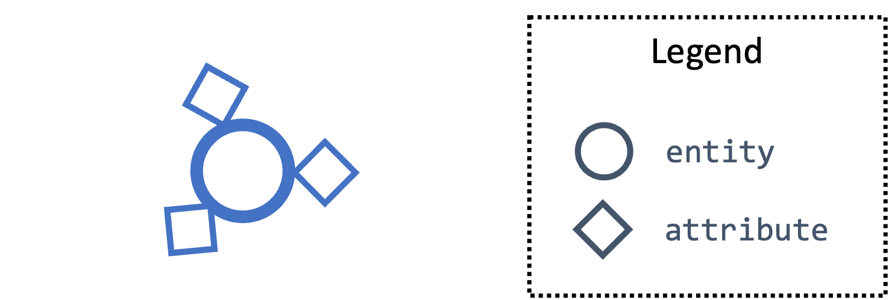
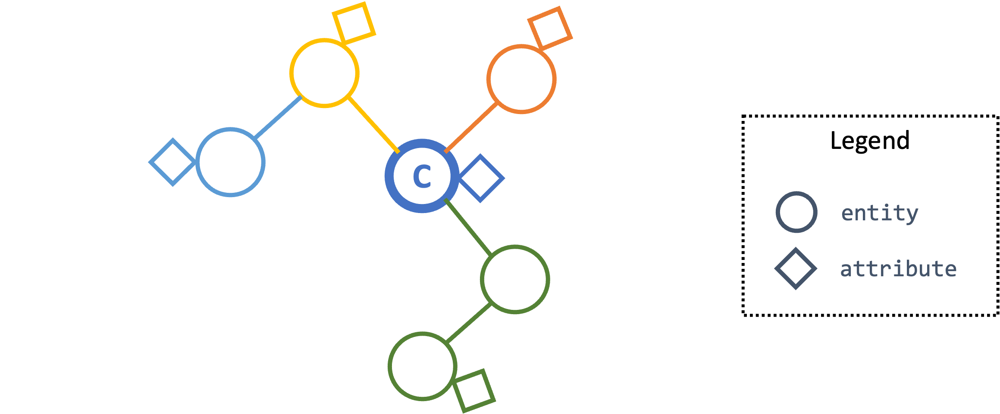
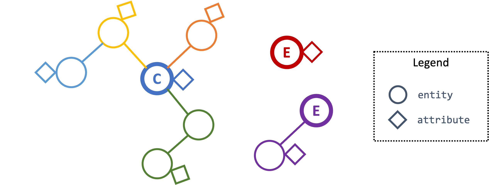

==========================
Graph Pattern and Matching
==========================

This section describes *Extended Centered Graph Pattern* (ECGP), which goes
into the body of the ``WHERE`` clause in Kestrel :ref:`language/commands:GET`
and :ref:`language/commands:FIND` commands. This section also covers timestamp
formating and styling in Kestrel.

*In a nutshell, ECGP describes a forest with one of the trees named the centered
subgraph and other trees named extended subgraphs.*

ECGP is a superset of `STIX pattern`_, which means one can directly write a
STIX pattern in the ``WHERE`` clause. ECGP gives semantic explanation of
standard STIX pattern, a.k.a., `Centered Graph Pattern`_, and goes a little
beyond it for simplicity and expressiveness. This section explains ECGP from
its simplest form to its full power in the following subsections.

Single Comparison Expression Pattern
====================================

Kestrel implements :ref:`language/tac:Entity-Based Reasoning`, so the simplest
task to perform with Kestrel is to :ref:`language/commands:GET` entities
according to one of their attributes. For example, one may want to get all
``powershell.exe`` processes executed on a monitored endpoint during a time
range. The pattern is very simple:

.. code-block:: coffeescript

    name = "powershell.exe"

This is called a *Comparison Expression*, which is composed of an attribute and
the specified value (check more in :ref:`language/eav:Common Entities and
Attributes`). In this case, a single comparison expression constructs this
simple pattern (ECGP). 

Assuming the endpoint can be specified by a Kestrel data source
``stixshfiter://edp1`` and the `Time Range`_ is ``2022-11-11T15:05:00Z`` to
``2022-11-12T08:00:00Z``, we can put the pattern in the ``WHERE`` clause of the
command, and the entire ``GET`` command is:

.. code-block:: coffeescript

    ps = GET process
         FROM stixshifter://edp1
         WHERE name = "powershell.exe"
         START 2022-11-11T15:05:00Z STOP 2022-11-12T08:00:00Z

Kestrel supports multiple stylings of writing a comparison expression:

    #. The command can be written in one or multiple lines with *any
       indentation style*. And the pattern itself can be written in one or
       multiple lines, a.k.a., either of the following is valid and the
       variable ``ps`` has the same entities as the following ``ps1`` and
       ``ps2``:

       .. code-block:: coffeescript

            ps1 = GET process FROM stixshifter://edp1 WHERE name = "powershell.exe"
                  START 2022-11-11T15:05:00Z STOP 2022-11-12T08:00:00Z

            ps2 = GET process
              FROM stixshifter://edp1
                        WHERE name =
              "powershell.exe"
                    START 2022-11-11T15:05:00Z
                STOP 2022-11-12T08:00:00Z

    #. One can use either single or double quotes around string literals,
       a.k.a., the following patterns are equivalent:

       .. code-block:: coffeescript

            name = 'powershell.exe'
            name = "powershell.exe"

    #. To be STIX pattern compatible, one can specify entity type before the
       attribute like ``entity_type:attribute``. For the simple powershell
       pattern, since the return entity type is already specified earlier in
       the ``GET`` command, this is redudant and optional. However, the
       specification of the entity type is required for :ref:`extended
       subgraphs<language/ecgp:Extended Centered Graph Pattern>`, which we will
       discuss in the more complex `Extended Centered Graph Pattern`_. In
       short, the following command returns exactly same results into ``ps3``
       as in ``ps``.

       .. code-block:: coffeescript

            ps3 = GET process
                  FROM stixshifter://edp1
                  WHERE process:name = 'powershell.exe'
                  START 2022-11-11T15:05:00Z STOP 2022-11-12T08:00:00Z

    #. To be STIX pattern compatible, one can put square brackets in the
       ``WHERE`` clause before the time range specification
       (``START``/``STOP``). That is to say, the following command returns
       exactly same results into ``ps4`` as in ``ps``.

       .. code-block:: coffeescript

            ps4 = GET process
                  FROM stixshifter://edp1
                  WHERE [process:name = 'powershell.exe']
                  START 2022-11-11T15:05:00Z STOP 2022-11-12T08:00:00Z

Kestrel supports three types of values in comparison expressions: a literal string, a
number, or a list (or nested list). For examples:

    - Number as value: ``src_port = 3389``

    - List as value: ``name IN ('bash', 'csh', "zsh", 'sh')``

    - Square bracket around list: ``dst_port IN [80, 443, 8000, 8888]``

    - Nested list support (flattened after parsing): ``name IN ('bash', ('csh', ('zsh')), "sh")``

Kestrel supports the following operators in comparison expression (yet a
specific `stix-shifter connector`_ used to execute a hunt may only implement a
subset of these, check the error message if you encountered a problem):

    - ``=``/``==``: They are the same.

    - ``>``/``>=``/``<``/``<=``: They work for number as a value.

    - ``!=``/``NOT``: The negative operator.

    - ``IN``: To be followed by a list or a nested list.

    - ``LIKE``: To be followed by a quoted string with wildcard ``%`` (as defined in SQL).

    - ``MATCHES``: To be followed by a quoted string of Regular Expression (`PCRE`_).

    - ``ISSUBSET``: Only used for deciding if an IP address/subnet is in a
      subnet, e.g., ``ipv4-addr:value ISSUBSET '198.51.100.0/24'``. Details in
      `STIX pattern`_.

    - ``ISSUPERSET``: Only used for deciding if an IP subnet is larger than
      another subnet/IP, e.g., ``ipv4-addr:value ISSUPERSET
      '198.51.100.0/24'``. Details in `STIX pattern`_.

Single Node Graph Pattern
=========================

Upgrading from specifying a single comparison expression to describing multiple
attributes of the returned entity in a pattern, one can use logical operators
``AND`` and ``OR`` to combine comparison expressions and use parenthesis ``()``
to raise the precedence of combined expressions.

Examples:

.. code-block:: coffeescript

    # a single (process) node graph pattern
    proc1 = GET process
            FROM stixshifter://edp1
            WHERE name = "powershell.exe" AND pid = 1234
            START 2022-11-11T15:05:00Z STOP 2022-11-12T08:00:00Z

    # a single (network-traffic) node graph pattern
    # this pattern is equivalent to `dst_port IN (80, 443)`
    netflow1 = GET network-traffic
               FROM stixshifter://gateway1
               WHERE dst_port = 80 OR dst_port = 443
               START 2022-11-11T15:05:00Z STOP 2022-11-12T08:00:00Z

    # a single (file) node graph pattern
    minikatz = GET file
               FROM stixshifter://edp1
               WHERE name = "C:\ProgramData\p.exe"
                  OR hashes.MD5 IN ( "1a4fe4413a92d478625d97b7df1bd0cf"
                                   , "b6ff8f31007a3629a3c4be8999001ec9"
                                   , "e8994399f1656e58f72443b8861ce5d1"
                                   , "9ae602fddb5d2f9b63c5eb6aad0a2612"
                                   )
               START 2022-11-11T15:05:00Z STOP 2022-11-12T08:00:00Z

    # a single (user-account) node graph pattern
    users = GET user-account
            FROM stixshifter://authlogs
            WHERE (user_id = 1001 AND account_login = "Tracy")
               OR  user_id = 0
               OR (user_id = 1003 AND is_privileged = true)
               OR (account_login = "JJ" AND is_privileged = true)
            START 2022-11-11T15:05:00Z STOP 2022-11-12T08:00:00Z

The result is a graph pattern that has a single node---the returned entity.

Centered Graph Pattern
======================

Using references ``_ref``/``_refs[*]`` in STIX, one can describe edges in a
graph pattern.  This extends a pattern from a single node to a tree with a
root. The tree is called the *centered subgraph*. The root is the returned
entity.

The above figure illustrates the centered graph pattern around the center node
``C`` (a process):

.. code-block:: coffeescript

    procs = GET process FROM stixshifter://edp1
            WHERE name = 'cmd.exe'                                     # blue attribute
              AND binary_ref.name MATCHES '.+\.(exe|dll|bat)$'         # orange branch
              AND opened_connection_refs[*].dst_ref.value = '10.1.1.1' # green branch
              AND ( ( parent_ref.name = 'explorer.exe' AND             # yellow branch
                      parent_ref.binary_ref.name = 'explorer.exe'      # lightblue branch
                    ) OR
                    ( parent_ref.name LIKE '%.exe' AND                 # yellow branch
                      parent_ref.binary_ref.name != 'powershell.exe'   # lightblue branch
                    )
                  )
            START 2022-11-11T15:05:00Z STOP 2022-11-12T08:00:00Z

Pattern Matching Explained
==========================

Kestrel matches an ECGP against each :ref:`record<language/tac:Record>`,
retrieves the records that contain instances of the ECGP, returns the center
entity of the ECGP to the Kestrel variable, and caches all entities in the
retrieved records in `firepit`_ (in-memory/on-disk/remote store established for
each Kestrel session).

More precisely, Kestrel generates one `STIX Observation Expression`_ from an
ECGP and appends the time range qualifier (``START``/``STOP``) to create one
STIX pattern before passing the STIX pattern to a Kestrel data source
interface, e.g., :doc:`../source/kestrel_datasource_stixshifter.interface`, to
match.

Currently, one STIX pattern generated by Kestrel only contain **one** `STIX
Observation Expression`_ and only the ``START``/``STOP`` qualifier is used.
Since one `STIX observation expression`_ is matched against one
:ref:`record<language/tac:Record>` in STIX, we get to the conclusion given at
the beginning of this subsection:

::

    Kestrel matches an ECGP against each record.

What if someone describes a large pattern in ECGP but the data source only has
tiny records? For example, one could write a ECGP as a :ref:`centered subgraph
<language/ecgp:Centered Graph Pattern>` with three nodes---the centered
process, the parent process, and the grandparent process:

.. code-block:: coffeescript

    procs = GET process FROM stixshifter://edp1
            WHERE name = 'cmd.exe'
              AND parent_ref.name = 'explorer.exe'
              AND parent_ref.parent_ref.name = 'abc.exe'

If the data source ``edp1`` defines :ref:`records<language/tac:Record>` as
individual system events or system calls---a record mostly has a process and
its parent process, but not its grandparent process---the ECGP will match
nothing since no single record in ``edp1`` can satisfy the large pattern.

This is a fundamental limitation when we run Kestrel
(:ref:`language/tac:Entity-Based Reasoning`) on top of the traditional
record-based systems. A Kestrel runtime can potentially split one ECGP into
multiple STIX Observation Expressions to match against multiple records, but:

    #. STIX does not define the size/boundary of a
       :ref:`record<language/tac:Record>` (STIX observation), and it is unknown
       into how many STIX Observation Expressions to split an ECGP.

    #. Each data source defines the size/boundary of
       :ref:`records<language/tac:Record>` differently, and the definition is
       not always well documented or retrievable by Kestrel via an API.

We suggest users write small Kestrel ECGP (subgraph with one-hop radius) to
mitigate this issue in real-world uses, especially when users don't know how
large a :ref:`record<language/tac:Record>` in a data source is. Users can
explicitly split a large pattern into smaller patterns (in
:ref:`language/commands:GET` commands) plus a few Kestrel
:ref:`language/commands:FIND` to connect them.  Each Kestrel command like
:ref:`language/commands:GET` and :ref:`language/commands:FIND` generates one or
more STIX patterns and assmebles results.

A graph database instead of record-based storing/retrieving is the ultimate
solution to this problem. More is discussed at :doc:`../theory`.

Extended Centered Graph Pattern
===============================

`Pattern Matching Explained`_ concludes that Kestrel matches an ECGP against
each :ref:`record<language/tac:Record>`. On one hand, records limit the
matching. On the other hand, results could provide extra information to match
the centered subgraph---there could be information in a
:ref:`record<language/tac:Record>` that is not connected to the center entity
(root of the :ref:`centered subgraph <language/ecgp:Centered Graph Pattern>`),
but the information is useful/auxiliary in finding/matching the :ref:`centered
subgraph <language/ecgp:Centered Graph Pattern>`.

Since everything is part of a graph in :ref:`language/tac:Entity-Based
Reasoning` (more discussion in :doc:`../theory`), the auxiliary information
should be able to express as subgraphs. Now we add the concept of *extended
subgraph* to ECGP, so ECGP is called *extended centered graph pattern*.

The above figure illustrates the extended centered graph pattern (``C`` is the
root of the centered subgraph; ``E`` is the root of extended subgraph):

.. code-block:: coffeescript

    procs = GET process FROM stixshifter://edp1
            WHERE name = 'cmd.exe'                                     # blue attribute
              AND binary_ref.name MATCHES '.+\.(exe|dll|bat)$'         # orange branch
              AND opened_connection_refs[*].dst_ref.value = '10.1.1.1' # green branch
              AND ipv4-addr:value NOT ISSUBSET '192.168.0.0/24'        # red subgraph
              AND ( ( parent_ref.name = 'explorer.exe' AND             # yellow branch
                      parent_ref.binary_ref.name = 'explorer.exe'      # lightblue branch
                    ) OR
                    ( parent_ref.name LIKE '%.exe' AND                 # yellow branch
                      parent_ref.binary_ref.name != 'powershell.exe'   # lightblue branch
                    )
                  )
              AND email-message:from_ref.value = 'admin@xyz.com'       # purple subgraph
            START 2022-11-11T15:05:00Z STOP 2022-11-12T08:00:00Z

The centered subgraph in this pattern is the same as the one in `Centered Graph
Pattern`_, while this ECGP specifies extra constraints for the match: any
matched record should contain an ``ipv4-addr`` in subnet ``192.168.0.0/24`` and
an email from ``admin@xyz.com``. Three rules for extended subgraph:

#. The root entity type of an extended subgraph should be different than the
   root entity type of the centered subgraph. Otherwise, the generated STIX
   pattern will view the extended subgraph as a branch from the centered
   subgraph.

#. The root entity type of an extended subgraph should be specified, followed
   by colon ``:``, then the attribute, operator, and value(s). The syntax is
   consistent with a STIX path, and the entity type is mandatory to mean an
   extended subgraph root.

#. The extended subgraphs can be spcified *anywhere* in the ECGP, which makes
   it possible to write complex logic, e.g., an extended subgraph is used when
   the centered graph is in one shape; otherwise, another extended subgraph or
   no extended subgraph is specified to help the match.

The example above is an extreme complex case to illustrate multiple unrelated
extended subgraphs in an ECGP. In real uses, the most commonly used extended
subgraph is host specification (only matching records on a specific host),
e.g.,

.. code-block:: coffeescript

    x-oca-asset:hostname = 'endpoint101'

Standard STIX does not have an `STIX Cyber Observable Objects`_ (SCO) for
host/pod/container, so OCA provides the customized SCO (entity) ``x-oca-asset``
as STIX extension at `OCA/stix-extension`_ (more description in
:ref:`language/eav:Entities in Kestrel`). ``x-oca-asset`` is supported by most
`stix-shifter connector`_. It has no reference from standard STIX SCO (entity)
so it is an isolated subgraph in a record, and the extended subgraph enables
pattern matching using such information.

Referring to a Variable
=======================

Beyond static patterns, Kestrel allows references to variables in ECGP, i.e.,
one can use ``variable.attribute`` to pass in a list of values in a
:ref:`comparison expression<language/ecgp:Single Comparison Expression
Pattern>` (not the variable itself since a comparison expression does not take
variable but values). This supports quick pattern building using existing
results, and it enables building patterns for cross-data source hunts.

.. code-block:: coffeescript

    # basic usage
    # `px` is a Kestrel variable of processes
    py1 = GET process FROM stixshifter://edp
          WHERE pid = px.pid

    # both `=` and `IN` are valid to use as operator for referred variable
    # py2 returns the same as py1
    py2 = GET process FROM stixshifter://edp
          WHERE pid IN px.pid

    # nested list is valid to use
    # all values will be flattened when parsed
    py3 = GET process FROM stixshifter://edp
          WHERE pid IN (123, px.pid, (4, 10548))

When one or more variable references are used in an ECGP, Kestrel automatically

#. Extracts the time ranges of entities (in the variables) from their
   :ref:`matched/retrieved records<language/ecgp:Pattern Matching Explained>`,

#. Unions the time ranges,

#. Adjusts the unioned time range with
   ``timerange_start/stop_offset`` in
   :doc:`../configuration`,

#. Generates the STIX pattern with the adjusted time range,

#. Passes the STIX pattern to a data source to match.

A user can override the generated time range by specifying ``START``/``STOP``
in the command where the the ECGP reside, e.g., :ref:`language/commands:GET`.

Two examples of variable references in an ECGP:

#. A hunter is traking lateral movement across two endpoints ``edp1`` and
   ``edp2``. She already grabbed a bunch of suspicious processes on ``edp1``
   into a Kestrel variable ``procs1``, and she retrieved all network traffic
   associated with processes into ``procs1``. Some of the network traffic have
   destination IP associated with ``edp2``, so she wants to trace the network
   traffic from ``procs1`` on ``edp1`` to a unknown list of processes on
   ``edp2`` and print their command lines. Assume ``edp1`` and ``edp2`` are
   configured as two Kestrel data sources, and she can do:

    .. code-block:: coffeescript

        # hunting with data source `stixshifter://edp1`
        procs1 = ...
        nt1 = FIND network-traffic CREATED BY procs1

        # display the source/destination IP/port
        # this is for human inspection purpose
        DISP nt1 ATTR src_ref.value, src_port, dst_ref.value, dst_port

        # get the other end of the network traffic, not in edp1 data, but in edp2 data/view
        # use <src IP, src port, dst IP, dst port, time> to uniquely identify the traffic
        # time is automatically inferred by Kestrel due to variable reference
        nt2 = GET network-traffic
              FROM stixshifter://edp2
              WHERE src_ref.value = nt1.src_ref.value
                AND src_port      = nt1.src_port
                AND dst_ref.value = nt1.dst_ref.value
                AND dst_port      = nt1.dst_port

        # more generally, <src_port, time> is usually sufficient as the unique identifier
        # time is automatically inferred by Kestrel due to variable reference
        # `nt2x` usually gets the same results as `nt2`
        nt2x = GET network-traffic
               FROM stixshifter://edp2
               WHERE src_ref.value = nt1.src_ref.value

        # now get the processes handling the traffic on `edp2` and print their command line
        procs2 = FIND process CREATED nt2
        DISP procs2 ATTR command_line

#. An endpoint ``edp`` is accessing the Internet through a proxy server
   ``pxy``. The Kestrel data source ``stixshifter://edp`` is the EDR on
   ``edp``, and another Kestrel data source ``stixshifter://pxy`` manages the
   proxy logs. Since all network traffic are proxyed, network traffic observed
   on ``edp`` all have remote IP as the proxy server, but not real remote IP.
   In order to get their real remote IP and run a Kestrel analytics to enrich
   the IP with some Threat Intelligence, the hunter needs to correlate the data
   first:

    .. code-block:: coffeescript

        # get the network traffic from `stixshifter://edp` to inspect
        nt_inner = ...

        # get the outter half of network traffic from the proxy using variable reference
        nt_outter = GET network-traffic
                    FROM stixshifter://pxy
                    WHERE src_ref.value = nt_inner.src_ref.value
                      AND src_port = nt_inner.src_port

        # display the real remote IP for human inspection
        DISP nt_outter ATTR dst_ref.value, dst_port

        # enrich the IPs in network-traffic with x-force threat intelligence
        APPLY python://xfeipenrich ON nt_outter

String and Raw String
=====================

Kestrel string literals in comparison expressions are like standard Python
strings. It supports escaping for special characters, e.g., ``\n`` means new
line.

String literals can be enclosed in matching single quotes (``'``) or double
quotes (``"``). The backslash (``\\``) character is used to escape characters
that otherwise have a special meaning, such as newline, backslash itself, or
the quote character.

Examples:

.. code-block:: coffeescript

    # the following will generate a STIX pattern
    # [process:command_line = 'powershell.exe "yes args"']
    pe1 = GET process FROM stixshifter://edp1
          WHERE command_line = "powershell.exe \"yes args\""

    # an easier way is to use single quote for string literal
    # when there are double quotes in the string
    # pe2 is the same as pe1
    pe2 = GET process FROM stixshifter://edp1
          WHERE command_line = 'powershell.exe "yes args"'

    # the following will generate a STIX pattern
    # [process:command_line = 'powershell.exe \'yes args\'']
    pe3 = GET process FROM stixshifter://edp1
          WHERE command_line = "powershell.exe 'yes args'"

    # backslash always needs to be escaped
    pe4 = GET process FROM stixshifter://edp1
          WHERE command_line = "C:\\Windows\\System32\\cmd.exe"

    # `\.` is the dot character in regex
    # use `\\.` since `\` needs to be escaped
    ps5 = GET process FROM stixshifter://edp1
          WHERE name MATCHES 'cmd\\.exe'

    # another regex escaping example that uses `\w` and `\.`
    ps5 = GET process FROM stixshifter://edp1
          WHERE name MATCHES '\\w+\\.exe'

The escaped strings are not friendly to the use of regular expression,
resulting one to write four backslashes ``\\\\`` to mean a single exact
backslash char, e.g., STIX pattern requires ``"[artifact:payload_bin MATCHES
'C:\\\\Windows\\\\system32\\\\svchost\\.exe']"`` to mean raw path
``C:\Windows\system32\svchost.exe``. This is explained in `Python re library`_.

To overcome the inconvenience, Kestrel provides *raw string* like Python does,
meaning there is no escaping character in a Kestrel raw string (raw string is
interpreted without escaping evaluation).

.. code-block:: coffeescript

    # f1 and f2 describes the same pattern:
    # using regex to match an exact string 'C:\Windows\System32\cmd.exe'

    f1 = GET file FROM stixshifter://edp1
         WHERE name MATCHES 'C:\\\\Windows\\\\System32\\\\cmd\\.exe'

    f2 = GET file FROM stixshifter://edp1
         WHERE name MATCHES r'C:\\Windows\\System32\\cmd\.exe'

    # raw string can be used not only in regex (keyword MATCHES), but any comparison expression
    # f3/f4 will get the same results as f1/f2, yet they use exact match instead of regex

    f3 = GET file FROM stixshifter://edp1
         WHERE name = 'C:\\Windows\\System32\\cmd.exe'

    f4 = GET file FROM stixshifter://edp1
         WHERE name = r'C:\Windows\System32\cmd.exe'

Time Range
==========

Both absolute and relative time ranges are supported in Kestrel (commands
:ref:`language/commands:GET` and :ref:`language/commands:FIND`).

Absolute Time Range
-------------------

Absolute time range is specified as ``START isotime STOP isotime`` where
``isotime`` is a string following the basic rules:

- `ISO 8601`_ format should be used.

- Both date and time are required. `ISO 8601`_ requires letter ``T`` between the two parts.

- UTC is the only timezone currently supported, which is indicated by the letter ``Z`` at the end.

- The time should be at least specified to *second*:

    - standard precision to *second*: ``2022-11-11T15:05:00Z``

    - sub-second support: ``2022-11-11T15:05:00.5Z``

    - millisecond support: ``2022-11-11T15:05:00.001Z``

    - microsecond support: ``2022-11-11T15:05:00.00001Z``

- Quoted or unquoted are both valid.

    - unquoted: ``2022-11-11T15:05:00Z``

    - single-quoted: ``'2022-11-11T15:05:00Z'``

    - double-quoted: ``"2022-11-11T15:05:00Z"``

- STIX compatible stylings:

    - standard STIX timestamp: ``t'2022-11-11T15:05:00Z'``

    - STIX variant (double quotes): ``t"2022-11-11T15:05:00Z"``

Relative Time Range
-------------------

Relative time range is specified as ``LAST int TIMEUNIT`` where ``TIMEUNIT``
are one of the keywords ``DAY``, ``HOUR``, ``MINUTE``, or ``SECOND``. When
executing, the parser will generate the absoluate time range using the system
time (where the Kestrel runtime executes) as the ``STOP`` time, and the
``START`` time goes back ``int`` ``TIMEUNIT`` according to the relative time
range specified.

.. _STIX pattern: http://docs.oasis-open.org/cti/stix/v2.0/stix-v2.0-part5-stix-patterning.html
.. _stix-shifter: https://github.com/opencybersecurityalliance/stix-shifter
.. _stix-shifter connector: https://github.com/opencybersecurityalliance/stix-shifter/blob/develop/OVERVIEW.md#available-connectors
.. _ISO 8601: https://en.wikipedia.org/wiki/ISO_8601
.. _PCRE: https://www.pcre.org/
.. _firepit: https://github.com/opencybersecurityalliance/firepit
.. _STIX Cyber Observable Objects: http://docs.oasis-open.org/cti/stix/v2.0/stix-v2.0-part4-cyber-observable-objects.html
.. _OCA/stix-extension: https://github.com/opencybersecurityalliance/stix-extensions
.. _STIX Observation Expression: http://docs.oasis-open.org/cti/stix/v2.0/cs01/part5-stix-patterning/stix-v2.0-cs01-part5-stix-patterning.html#_Toc496717745
.. _Python re library: https://docs.python.org/3/library/re.html
