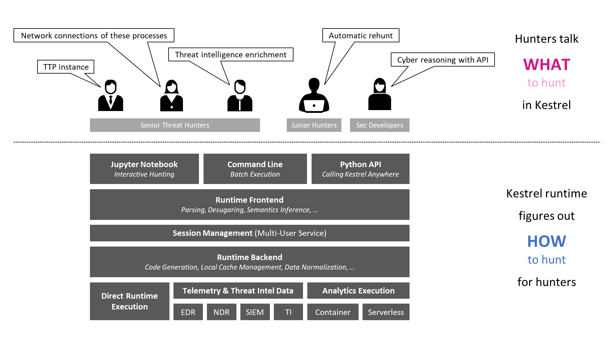

================
What is Kestrel?
================

Dive into the essence of cyber threat hunting, think about improving it, and
introduce Kestrel.

Cyberthreat Hunting
====================

Cyberthreat hunting is the planning and developing of a threat discovery program on
an ad hoc basis against new and customized advanced persistent threats (APT). Cyberthreat hunting
is comprised of several activities such as:

1. Understanding the security measurements in the target environment.
2. Thinking about potential threats escaping existing defenses.
3. Obtaining useful observations from system and network activities.
4. Developing threat hypotheses.
5. Revising threat hypotheses iteratively with the last two steps.
6. Confirming new threats.

Threat hunters create new intrusion detection system (IDS) instances every day
with a combination of data source queries, complex data processing, machine
learning testing, threat intelligence enrichment, proprietary detection logic,
and more. Threat hunters take advantage of scripting languages, spreadsheets,
whiteboards, and other tools to plan and execute their hunts. In traditional
cyberthreat hunting, many pieces of hunts are written against specific data
sources and data types, which makes the domain knowledge in them not reusable,
and hunters need to express the same knowledge again and again for different
hunts.

*That's tedious!*

Can we improve it?

Do Not Repeat Yourself
======================

- **Don't** Repeatedly write a Tactics, Techniques and Procedures (TTP) pattern
  in different endpoint detection and response (EDR) query languages.

- **Do** Express all patterns in a common language so that it can be compiled to
  different EDR queries and Security Information and Event Management (SIEM)
  APIs.

- **Don't** Repeatedly write dependent hunting steps such as getting child
  processes for suspicious processes against various record/log formats in
  different parts of a hunt.

- **Do** Express flows of hunting steps in a common means that can be reused
  and re-executed at different parts of a hunt or even in different hunts.

- **Don't** Repeatedly write different execution-environment adapters for an
  implemented domain-specific detection module or a proprietary detection box.

- **Do** Express analytics execution with uniform input/output schema and
  encapsulating existing analytics to operate in a reusable manner.

Reading carefully, you will find the examples of repeats are actually not
literally repeating. Each repeat is a little different from its
siblings due to their different execution environments. We need to take it a
little bit further to find what is repeated and how to not repeat ourselves.

Two Types of Questions
======================

Threat hunting activities can be summarized by asking and answering two types of
questions:

- What to hunt?

    - What is the threat hypothesis?
    - What is the next step?
    - What threat intelligence should be added?
    - What machine learning models fit?

- How to hunt?

    - How to query this EDR?
    - How to extract the field for the next query?
    - How to enrich this data?
    - How to plug in this machine learning model?

Any threat hunting activity involves both types of questions and the answers
to both questions contain domain-specific knowledge. However, the types of domain
knowledge regarding these two types of questions are not the same. The answers
to the *what* contain the domain knowledge that is highly creative, mostly
abstract, and largely reusable from one hunt to another, while the answers to the
*how* guides the realization of the *what* and are replaced from one hunting
platform to another.

To not repeat ourselves, we need to identify and split the *what* and *how* for
all hunting steps and flows, and answer them separately -- the *what* will be
reused in different parts of a hunt or different hunts, while the *how* will be
developed to instantiate *what* regarding their different environments.

With the understanding of the two types of domain knowledge invoked in threat
hunting, we can start to reuse domain knowledge regarding the questions of
*what* and not repeat ourselves, yet we still need to answer the tremendous
amount of mundane questions of *how*, which is hunting platform-specific and
not repeatable. Can we go further?

Human + Machine
===============

In traditional threat hunting, hunters answer both questions of *what to hunt*
and *how to hunt*. While there is no doubt that human intelligence and creativity are
the irreplaceable secret sauce of asking and answering the questions of the
*what*, it is a waste of time to manually answer most questions of
the *how*, which is just a translation between the knowledge in *what* and
execution instructions specified by different hunting platforms.

We know that machines are good at solving translation problems with well-defined
grammars fast.

Why not create an *efficient cyberthreat hunting symbiosis* with humans and
machines to ask and answer different types of hunting questions and enjoy their
strengths and values?

.. _kestrel_in_a_nutshell:

Kestrel in a Nutshell
=====================

Kestrel provides a layer of abstraction to stop the repetition involved in
cyberthreat hunting.

- Kestrel language: A threat hunting language for a human to express *what to
  hunt*.

    - Expressing the knowledge of *what* in patterns, analytics, and hunt flows.
    - Composing reusable hunting flows from individual hunting steps.
    - Reasoning with human-friendly entity-based data representation abstraction.
    - Thinking across heterogeneous data and threat intelligence sources.
    - Applying existing public and proprietary detection logic as analytics.
    - Reusing and sharing individual hunting steps and entire hunt books.

- Kestrel runtime: A machine interpreter that deals with *how to hunt*.

    - Compiling the *what* against specific hunting platform instructions.
    - Executing the compiled code locally and remotely.
    - Assembling raw logs and records into entities for entity-based reasoning.
    - Caching intermediate data and related records for fast response.
    - Prefetching related logs and records for link construction between entities.
    - Defining extensible interfaces for data sources and analytics execution.

Architecture
============

The entire Kestrel runtime consists of the following Python packages:

- ``kestrel`` (in *kestrel-lang* repository): The interpreter including
  parser, session management, code generation, data source and
  analytics interface managers, and a command-line front end.

- ``firepit`` (in *firepit* repository): The Kestrel internal data storage
  ingesting data from data sources, caching related data, and linking records
  against each Kestrel variable.

- ``kestrel_datasource_stixshifter`` (in *kestrel-lang* repository): The
  STIX-Shifter data source interface for managing data sources via
  STIX-Shifter.

- ``kestrel_datasource_stixbundle`` (in *kestrel-lang* repository): The data
  source interface for ingesting static telemetry data that is already sealed
  in STIX bundles.

- ``kestrel_analytics_docker`` (in *kestrel-lang* repository): The analytics
  interface that executes analytics in docker containers.

- ``kestrel_jupyter_kernel`` (in *kestrel-jupyter* repository): The Kestrel
  Jupyter Notebook kernel to use Kestrel in a Jupyter notebook.

- ``kestrel_ipython`` (in *kestrel-jupyter* repository): The iPython *magic
  command* realization for writing native Kestrel in iPython.
