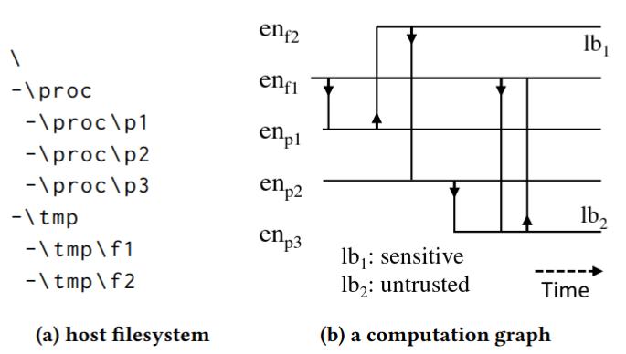
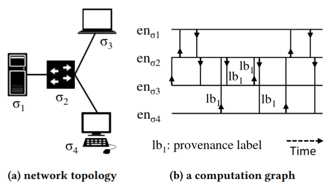

=====================
Theory Behind Kestrel
=====================

We define a :ref:`hunt<language/tac:hunt>` as a procedure to find a set of
entities in the monitored environment that associates with a cyber threat. We
will discuss a more comprehensive definition here as well as the relation
between the definitions.

Threat Intelligence Computing
=============================

In an ideal world where we can monitor all activities of computations, we can
model computations as labeled temporal graphs. Each node in the graph is an
:ref:`entity<language/tac:entity>`, and each edge in the graph is an event that
happens at a specific time and connects two entities. We call such graph
*computation graph*, and computation graph instances at different monitoring
levels, e.g., host-level, network-level, are illustrated below:

A computation graph objectively records all activities of a computation, either
benign and malicious parts. If one has access to such computation graphs, one
can perform threat hunting as a graph computation problem to find a subgraph
associated with each threat. Graph computation does not need to be complicated,
and we prove that one only need one type of operation---functional graph
pattern matching---to achieve Turing-complete *cyber reasoning* procedures.
Cyber reasoning is a procedure generalized from threat hunting to iteratively
finding subgraphs of one's interest. One may be interested in finding a
subgraph that describes a threat, a subgraph that describes the origin of given
processes, a subgraph that describes the impacts of a malicious process, etc.
Further mitigation can follow such as blocking a traffic flow, killing a
process, or shutting down a machine.

We formally define computation graph, model cyber reasoning as a graph
computation problem, introduce functional graph pattern matching, and
demonstrate the power of it with a prototype cyber reasoning language
:math:`{\tau}`-calculus in the paper *Threat Intelligence Computing* [1]_. The
establishment of *dynamic cyber reasoning* via threat intelligence computing
largely enhances the detection efficiency of unknown threats, especially
against Advanced Persistent Threats (APT) that are dynamically developed and
customized for each attack target [2]_.

Theory And Reality
==================

We cannot assume we get a complete computation graph in reality. We cannot
assume all real-world monitored data are connected. While we are pushing for
big data security towards complete computation graph, we design Kestrel to use
data that exists today even with disconnected entities. We relax the
assumptions and derive threat hunting from a subgraph identification problem
into a subset identification problem regarding the possible disconnectivity in
real-world data. In the meanwhile, we have :ref:`language/commands:find`
command in Kestrel to move from one node to another in a real-world incomplete
computation graph if the connection exists. And STIX pattern used in
:ref:`language/commands:get` command provides some capability to express simple
graph patterns.

The open source of Kestrel is not an end. It is the beginning to evolve with
the entire community including threat hunters, security developers, security
vendors, threat intelligence providers, and everyone. We are not retreating
from the beautiful and composable functional graph computation methodology for
cyber reasoning. We are paving a realistic road towards it.

Acknowledgment
==============

This open source project is built upon research sponsored by the Air Force
Research Laboratory (AFRL) and the Defense Advanced Research Agency (DARPA).
The fundamental research is part of the DARPA `Transparent Computing (TC)`_ and
DARPA `Cyber-Hunting at Scale (CHASE)`_ program. The views, opinions, and/or
findings contained in our papers and talks are those of the authors and should
not be interpreted as representing the official views or policies of the
Department of Defense or the U.S. Government.

References
==========

.. [1] Xiaokui Shu, Frederico Araujo, Douglas L. Schales, Marc Ph. Stoecklin,
   Jiyong Jang, Heqing Huang, and Josyula R. Rao. 2018. Threat Intelligence
   Computing. In Proceedings of the 2018 ACM SIGSAC Conference on Computer and
   Communications Security (CCS '18). Association for Computing Machinery, New
   York, NY, USA, 1883–1898. DOI: https://doi.org/10.1145/3243734.3243829

.. [2] Xiaokui Shu. 2020. Unleashing Cyber Reasoning: DARPA Transparent
   Computing Threat Hunting Retrospective. Sponored talk at Annual Computer
   Security Applications Conference (ACSAC) '20.
   https://www.youtube.com/watch?v=9IlUoGpXvYo

.. _Transparent Computing (TC): https://www.darpa.mil/program/transparent-computing
.. _Cyber-Hunting at Scale (CHASE): https://www.darpa.mil/program/cyber-hunting-at-scale
