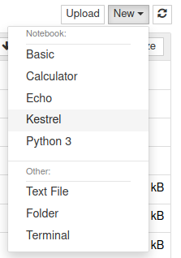
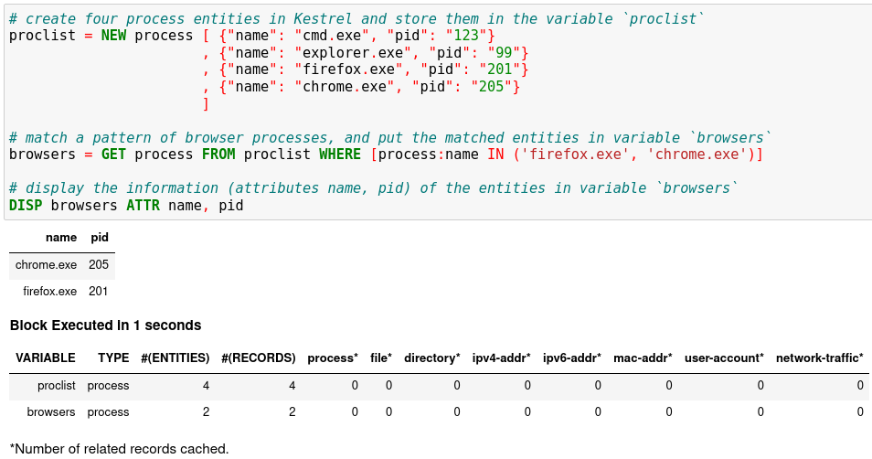
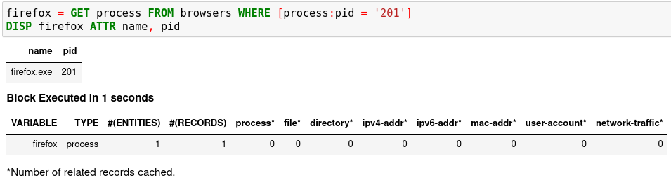
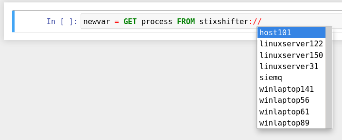
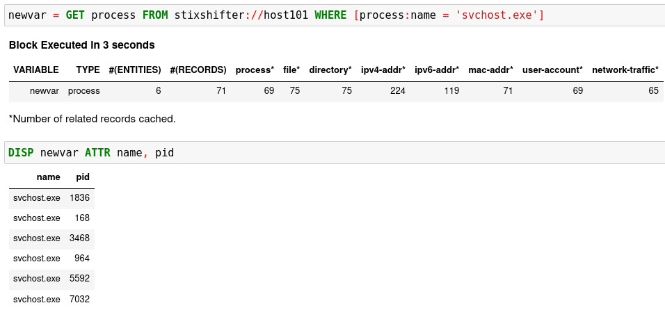
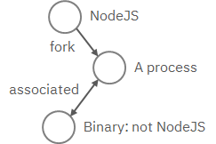
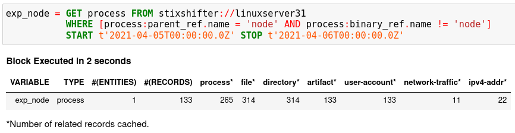
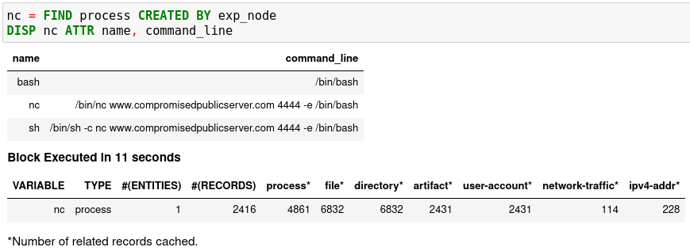
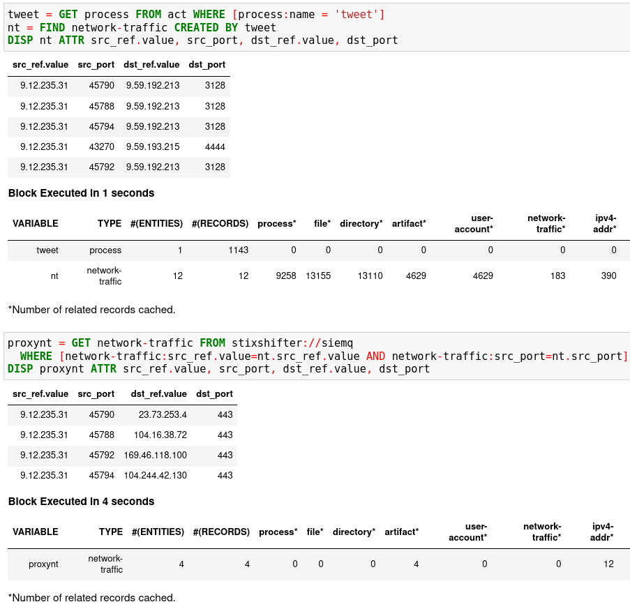
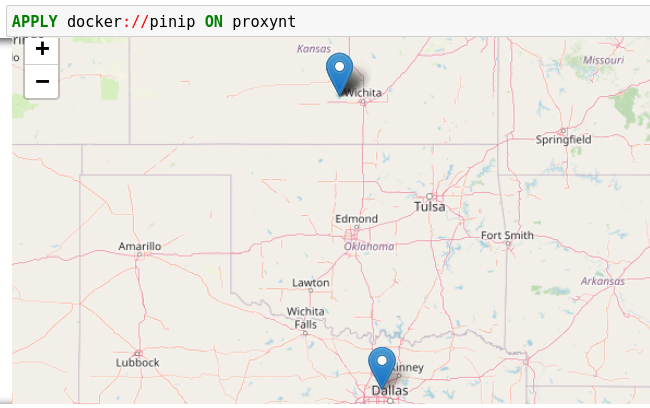

=======================
Threat Hunting Tutorial
=======================

For this tutorial, you will install Kestrel runtime, write your first hello world hunt, investigate into a
data source, apply analytics, and compose larger hunt flows.

Hello World Hunt
================

Installation
------------

Make sure you have `Python 3`_ and `pip`_ installed. The simplest way to
install Kestrel is to use pip:

.. code-block:: console

    $ pip install --upgrade pip setuptools wheel
    $ pip install kestrel-lang

If you need more control, check out the following guide on :doc:`installation` for more details.

Write Your First Hunt Flow
--------------------------

Since you haven't set up a data source to
retrieve real-world monitored data yet, you will create some entities in Kestrel
to hunt.

.. code-block::

    # create four process entities in Kestrel and store them in the variable `proclist`
    proclist = NEW process [ {"name": "cmd.exe", "pid": "123"}
                           , {"name": "explorer.exe", "pid": "99"}
                           , {"name": "firefox.exe", "pid": "201"}
                           , {"name": "chrome.exe", "pid": "205"}
                           ]

    # match a pattern of browser processes, and put the matched entities in variable `browsers`
    browsers = GET process FROM proclist WHERE [process:name IN ('firefox.exe', 'chrome.exe')]

    # display the information (attributes name, pid) of the entities in variable `browsers`
    DISP browsers ATTR name, pid

Copy this simple hunt flow, paste into your favorite text editor, and save to a
file ``helloworld.hf``.

Execute The Hunt
----------------

Execute the entire hunt flow using the Kestrel command-line utility in a terminal:

.. code-block:: console

    $ kestrel helloworld.hf

This is the batch execution mode of Kestrel. The hunt flow will be executed as
a whole and all results are printed at the end of the execution.

::

           name pid
     chrome.exe 205
    firefox.exe 201

    [SUMMARY] block executed in 1 seconds
    VARIABLE    TYPE  #(ENTITIES)  #(RECORDS)  process*
    proclist process            4           4         0
    browsers process            2           2         0
    *Number of related records cached.

The results have two parts:

- The results of the ``DISP`` (display) command.

- The execution summary.

Kestrel + Jupyter
=================

Develop a hunt flow in Jupyter Notebook.

Installation
------------

Install and set up the Kestrel Jupyter Notebook kernel:

.. code-block:: console

    $ pip install kestrel-jupyter
    $ python -m kestrel_jupyter_kernel.setup

Creating A Hunt Book
--------------------

1. Launch a Jupyter Notebook (not Jupyter Lab, which is not fully supported
   yet) from the terminal:

.. code-block:: console

    $ jupyter notebook

2. Start a hunt book by clicking the ``New`` button on the top left and choose
   ``Kestrel`` kernel:

3. In the first cell, copy and paste the hello world hunt flow from the section
   `Write Your First Hunt Flow`, and press ``Shifter`` + ``Enter`` to run it.

4. The result shows two process entities in the variable ``browsers``. The
   ``DISP`` command is an inspection command (more in :doc:`language`), which
   prints entity information.

5. When you get an idea of the pid associated with the firefox process, you can
   add another hunt step in a new notebook cell to capture the firefox process
   only, and then show the results.

::

    firefox = GET process FROM browsers WHERE [process:pid = '201']
    DISP firefox ATTR name, pid

6. Run the second cell with ``Shifter`` + ``Enter``. The result is a hunt book
   with two cells and the results from them.

You can put any number of hunt steps in a hunt book cell. If you need the
results of some hunt steps to decide what to hunt next, you can put the *some
steps* in one cell and execute it. After getting the results, write the
following hunt steps in the next cell.

Saving A Hunt Book
------------------

Now you can save the hunt book as any Jupyter Notebook, re-execute it, edit or
add more hunt steps, or share the hunt book with others.

Hunting On Real-World Data
==========================

Now it is time to hunt on real-world data. Before you start, you must identify
an available data source, which can be a host monitor, an EDR, a SIEM, a
firewall, etc. In the first release of Kestrel, the *STIX-Shifter
data source interface* is included. `STIX-Shifter`_ supports lots of data sources to
connect to Kestrel. Check if yours is in the `supported list`_ before you start.

Checking Data Sources
---------------------

Two example data sources are described. Select from the following options to start.

Option 1: Sysmon + Elasticsearch
^^^^^^^^^^^^^^^^^^^^^^^^^^^^^^^^

`Sysmon`_ is a popular host monitor, but it is not a full monitoring
stack, meaning that it does not store data or handle queries. To create the queryable stack
for Kestrel, set up an `Elasticsearch`_ instance to store the monitored
data.

1. Install Sysmon on a host to monitor it.

2. Install Elasticsearch somewhere that is reachable by both the monitored host
   and the hunter's machine where Kestrel and STIX-Shifter are running.

3. Set up Sysmon ingestion into Elasticsearch, for example, wtih `Logstash`_.

4. Pick up an index for the data source in Elasticsearch, for example, ``host101``.
   This allows you to differentiate data stored in the same Elasticsearch but
   are from different monitored hosts.

5. Set up a username and password or API keys in Elasticsearch. Test API query to the
   Elasticsearch.

Option 2: CarbonBlack
^^^^^^^^^^^^^^^^^^^^^

CarbonBlack provides a full monitoring and data access stack, which can be
directly used by STIX-Shifter and Kestrel.

The only task is to get an API key of the CarbonBlack Response or CarbonBlack
Cloud service which is running. You also need to know whether the service is
CarbonBlack Response or Cloud, which corresponds to different STIX-Shifter
connectors to install.

STIX-Shifter Setup
------------------

STIX-Shifter is automatically installed when installing ``kestrel``. However,
you need to install additional STIX-Shifter connector packages for each
specific data sources. Example connectors:

- Sysmon data in Elasticsearch: ``stix-shifter-modules-elastic-ecs``.
- Sysflow data in Elasticsearch: ``stix-shifter-modules-elastic-ecs``.
- CarbonBlack Response: ``stix-shifter-modules-carbonblack``.
- CarbonBlack Cloud: ``stix-shifter-modules-cbcloud``.
- IBM QRadar: ``stix-shifter-modules-qradar``.

For example, to access Sysmon data in Elasticsearch, install the corresponding connector:

.. code-block:: console

    $ pip install stix-shifter-modules-elastic-ecs

Suppose you set up an Elasticsearch server at ``elastic.securitylog.company.com``
with default port ``9200``. You would add the Sysmon monitored host to it as index
``host101``. Then obtain the API ID and API key of the Elasticsearch server as
``VuaCfGcBCdbkQm-e5aOx`` and ``ui2lp2axTNmsyakw9tvNnw``, respectively.

The Kestrel STIX-Shifter data source interface loads the information above with
environment variables when querying STIX-Shifter. You must set up three
environment variables for each data source. Refer to
:doc:`source/kestrel_datasource_stixshifter.interface` for more details.

.. code-block:: console

    $ export STIXSHIFTER_HOST101_CONNECTOR=elastic_ecs
    $ export STIXSHIFTER_HOST101_CONNECTION='{"host":"elastic.securitylog.company.com", "port":9200, "indices":"host101"}'
    $ export STIXSHIFTER_HOST101_CONFIG='{"auth":{"id":"VuaCfGcBCdbkQm-e5aOx", "api_key":"ui2lp2axTNmsyakw9tvNnw"}}'

Another example of the configuration for an IBM QRadar instance to connect:

.. code-block:: console

    $ export STIXSHIFTER_SIEMQ_CONNECTOR=qradar
    $ export STIXSHIFTER_SIEMQ_CONNECTION='{"host":"qradar.securitylog.company.com", "port":443}'
    $ export STIXSHIFTER_SIEMQ_CONFIG='{"auth":{"SEC":"123e4567-e89b-12d3-a456-426614174000"}}'

The configurations can be tested in STIX-Shifter directly to see whether the
query translation and transmission work. Refer to `STIX-Shifter documentation`_
for more details.

Pattern Matching Against Real-World Data
----------------------------------------

Now restart Jupyter Notebook from the same terminal where environment variables
are exported:

.. code-block:: console

    $ jupyter notebook

Write the first ``GET`` command to use STIX-Shifter data source
interface. After typing the ``stixshifter://`` URI prefix, press ``TAB`` to
auto-complete the available data sources loaded from environment variables:

You can put up a simple pattern to search the entity pool of the Sysmon data
source:

**[Empty Return]** You may get an empty return. That is not bad! No error means
the data source connection is set up correctly. The reason for the empty return
is that by default STIX-shifter only searches the last five minutes of data if no
time range is provided in the ``WHERE`` clause, and you are lucky that the data
source has no matched data in the last five minutes. If this is the case, you
can get data by specifying a time range at the end of the GET command, for example,
``START t'2021-05-06T00:00:00Z' STOP t'2021-05-07T00:00:00Z'`` to search for
all data on the day May 6, 2021. You need to use ISO timestamp and both
``START`` and ``STOP`` keywords. Press ``tab`` in the middle of the timestamp
to complete it. For more information, see the command:GET section in
:doc:`language`.

**[Python Version Issue]** STIX-Shifter has compatibility issues with Python >
3.6. Test STIX-Shifter manually if Kestrel encounters a data source issue and
suggests so. If the Python version is the issue, you might need to install Python
3.6, for example, ``sudo dnf install python3.6``, and create `Python virtual
environment`_ from Python 3.6 to restart.

Matching A TTP Pattern
----------------------

Write a pattern to match a Tactics, Techniques, and Procedures
(TTP). The TTP pattern describes a web service exploit where a worker process
of a web service, for example, ``nginx`` or ``NodeJS``, is associated with a binary
that is not the web service. This happens when the worker process is exploited,
and the common binary to execute is a shell, for example, ``bash``.

Put the TTP in a STIX pattern, match it against a `Sysflow`_ data source,
and extract exploited processes from it. Specify a time range, which is
highly recommended when there is no referred Kestrel variables in the ``WHERE``
clause. If no time range is given, STIX-Shifter might apply a default time range,
for example, the last 10 minutes. Read more about ``GET`` in :doc:`language`.

Knowing Your Variables
======================

After execution of each cell, Kestrel will give a summary on new variables such
as how many entities and records are associated with it. For definitions of
entity and record, see :doc:`language`. The summary also shows how
many related records are returned from a data source and cached by Kestrel for
future use, for example, `Finding Connected Entities`_. For example, when asking the
TTP pattern above, the Sysflow data source also returns some
network traffic associated with the processes in the returned variable
``exp_node``. Kestrel caches it and gives the information in the summary.

Now that you have some entities back from data sources, you might be wondering what's
in ``exp_node``. You need to have some hunt steps to inspect the Kestrel
variables.  The most basic ones are ``INFO`` and ``DISP``, which shows the
attributes and statistics of a variable as well as displays entities in it,
respectively. Read more about them in :doc:`language`.

Connecting Hunt Steps
=====================

The power of hunting comes from the composition of hunt steps into large and
dynamic hunt flows. Generally, you can use a Kestrel variable in any following
command in the same notebook or same Kestrel session. There are two common ways
to do this:

Finding Connected Entities
--------------------------

You can find connected entities easily in Kestrel, for example, child processes created
of processes, network traffic created by processes, files loaded by processes,
users who own the processes. To do so, use the ``FIND`` command with a
previously created Kestrel variable, which stores a list of entities from which
to find connected entities. Note that not all data sources have relation data,
and not all STIX-Shifter connector modules are mature enough to translate
relation data. The data sources known to work are `sysmon`_ and `Sysflow`_ both
through ``elastic_ecs`` STIX-Shifter connector. Read more in :doc:`language`.

Referring to Kestrel Variables in GET
-------------------------------------

Another common way to link entities in hunt flows is to write a new ``GET``
command with referred variables. You can either ``GET`` new entities within an
existing variable (a pool/list of entities similar to a data source pool of
entities), or refer to a variable in the ``WHERE`` clause of ``GET``. The former is shown
in the `hello world hunt`_. See another example of it plus an
example of the latter case.

In the first notebook cell, you ``GET`` all processes with name ``tweet`` from a
Kestrel variable ``act`` (the malicious activities as the child processes of
variable ``nc`` in `Finding Connected Entities`_). Then you ``FIND`` their
related network traffic and print out the information. The network traffic
shows a proxy server as the destination IP.

To get the real destination IP addresses, you need to ask the proxy server or
the SIEM system that stores the proxy logs, for example, `siemq` (QRadar) as
provided to Kestrel in `STIX-Shifter Setup`_. This is an XDR hunt that goes across
host/EDR to SIEM/firewall.

Write the ``GET`` in the second notebook cell. In the ``WHERE`` clause,
specify the source IP and source port to identify the network traffic.  Kestrel
will derive the time range for the ``GET``, which makes the relationship
resolution unique. Lastly, show the other half of the proxy traffic to the
Internet using ``DISP``.

Applying an Analytics
=====================

You can apply any external analyzing or detection logic to add new attributes
to existing Kestrel variables or return visualizations. Kestrel treats
analytics as black boxes and only cares about the input and output formats. So it is
possible to wrap even proprietary software in Kestrel analytics. Read more
about analytics in :doc:`language`.

Docker Analytics Setup
----------------------

Kestrel ships with a docker analytics interface, plus 5 example analytics for
*threat intelligence enrichment via SANS API*, *suspicious process scoring*,
*machine learning model testing*, *geolocation visualization*, and *data
plotting*.  Check our ``kestrel-analytics`` repository for more details.

To use an analytics via the docker interface, you need to have `docker`_
installed, and then build the docker container for that analytics. For example,
to build a docker container for the *geolocation visualization* analytics, go
to its source code and run the command:

.. code-block:: console

    $ docker build -t kestrel-analytics-pinip .

Run an Analytics
----------------

Apply the analytics you built on the variable ``proxynt`` from `Referring to
Kestrel Variables in GET`_ to pin IP addresses found in the variable onto a
map. Before you finish typing the command, you can pause halfway at ``APPLY
docker://`` and press ``TAB`` to list all available analytics from the Kestrel
docker analytics interface.

This analytics first gets geolocations for all IP addresses in the network
traffic using the `GeoIP2`_ API. Then it uses `Folium`_ library to pin them on
a map. Lastly, it serializes the output into a Kestrel display object and hands
it over to the analytics manager in Kestrel runtime.

Creating Your Analytics
-----------------------

It is simple to create your analytics, even analytics interface (see the last
section in :doc:`language` for more details). To create a new analytics using
the Kestrel docker analytics interface (more at
:doc:`source/kestrel_analytics_docker.interface`), you can use the container
template in the ``kestrel-analytics`` repository. After adding some meat or
wrapping existing code into an analytics, build a docker container with the
name prefix ``kestrel-analytics-``. For example, the full container name for
the ``pinip`` analytics we apply in the `Run An Analytics`_ section is
``kestrel-analytics-pinip``.

Analytics are available to Kestrel immediately after they are built and can be
listed in a terminal:

.. code-block:: console

    $ docker image ls

Forking and Merging Hunt Flows
==============================

Threat hunters might come up with different threat hypotheses to verify from time
to time. And you can fork a hunt flow by running a command with a previously used
Kestrel variable---the variable that is used in multiple commands are the point of
fork. It is simple to merge hunt flows by merging variables like ``newvar =
varA + varB + varC``. Read more about composable hunt flows in :doc:`language`.

More About The Language
=======================

Congratulations! You finished this challenging full Kestrel tutorial.

To learn more about the language terms, concepts, syntax, and semantics for
writing composable hunt flows, see :doc:`language`.

.. _pip: https://pip.pypa.io
.. _Python 3: http://docs.python-guide.org/en/latest/starting/installation/
.. _STIX-Shifter: https://github.com/opencybersecurityalliance/stix-shifter
.. _supported list: https://github.com/opencybersecurityalliance/stix-shifter/blob/develop/OVERVIEW.md#available-connectors
.. _sysmon: https://docs.microsoft.com/en-us/sysinternals/downloads/sysmon
.. _Elasticsearch: https://www.elastic.co/
.. _STIX-Shifter documentation: https://github.com/opencybersecurityalliance/stix-shifter/blob/develop/OVERVIEW.md
.. _Python virtual environment: https://packaging.python.org/guides/installing-using-pip-and-virtual-environments/
.. _Sysflow: https://github.com/sysflow-telemetry
.. _GeoIP2: https://www.maxmind.com/
.. _Folium: https://python-visualization.github.io/folium/
.. _Logstash: https://www.elastic.co/logstash
.. _docker: https://www.docker.com/
